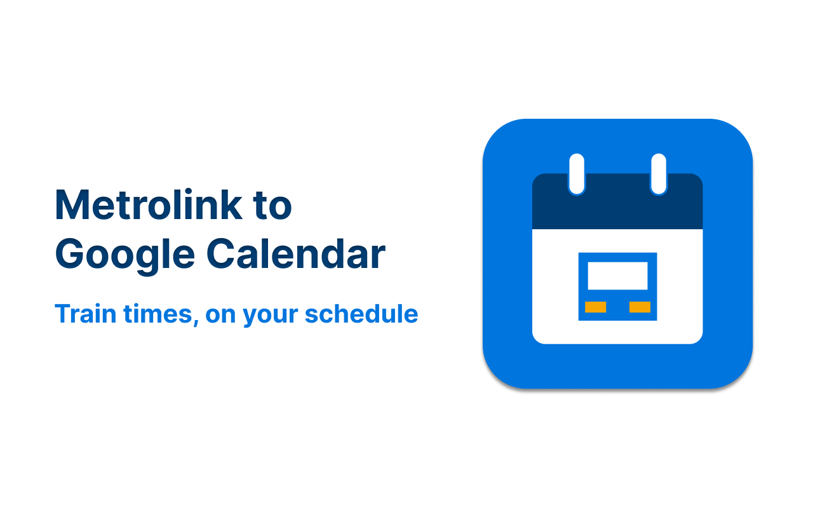
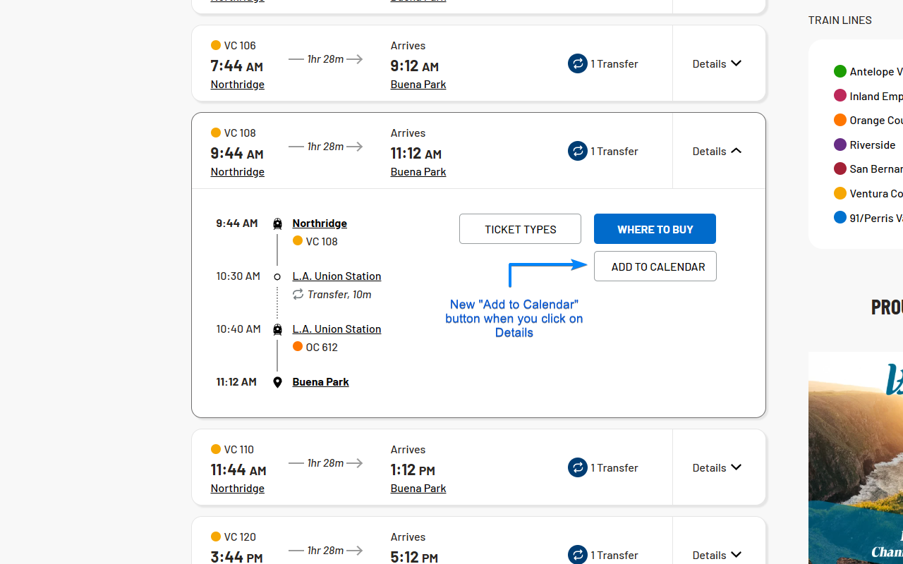
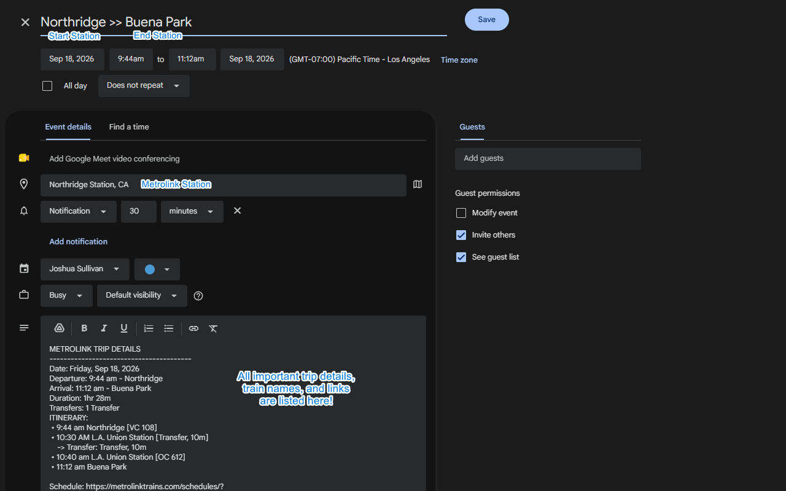
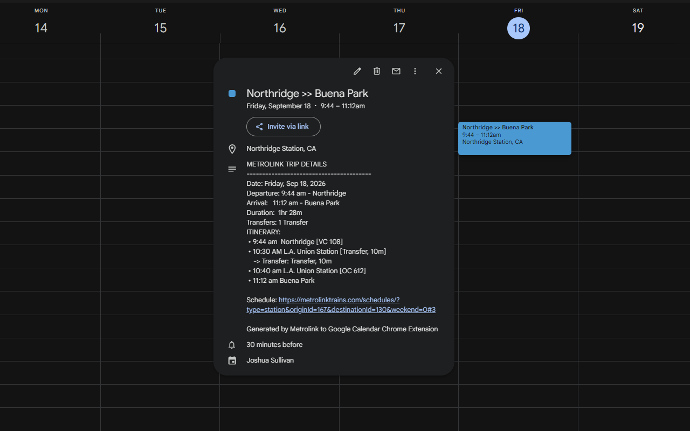

# Metrolink to Google Calendar Chrome Extension



A lightweight, privacy-focused Chrome Extension that adds an **"Add to Google Calendar"** button to Metrolink schedule cards, allowing you to add train departures, arrivals, stations, and transfer itineraries to your calendar.

## How to Use 

Download it on Chrome Web Store [here](https://chromewebstore.google.com/detail/metrolink-to-google-calen/apelihefpnlkgengkcmmadhfmebejojp)!

## How to Test on Metrolink

1. Open any Metrolink schedule search in Chrome, for example:
   ```
   https://metrolinktrains.com/schedules/?type=station&originId=156&destinationId=103&weekend=3#0
   ```
2. Click **Details** on any train card (e.g. the 9:28 AM Tustin to Chatsworth train).
3. Look directly beneath the blue **"WHERE TO BUY"** button on the right side of the card details.
4. You will see the white **"ADD TO CALENDAR"** button.
5. Click **"ADD TO CALENDAR"**:
   - A new tab will open directly to Google Calendar with your event prefilled (title, times, station location, and full itinerary).
   - Click **Save** in Google Calendar to add it to your schedule!

## Images

*Image 1: New "Add to Calendar" button on https://metrolinktrains.com/schedules*


*Image 2: New calendar event! With auto-filled train schedule data*


*Image 3: Example of the new event on my calendar*